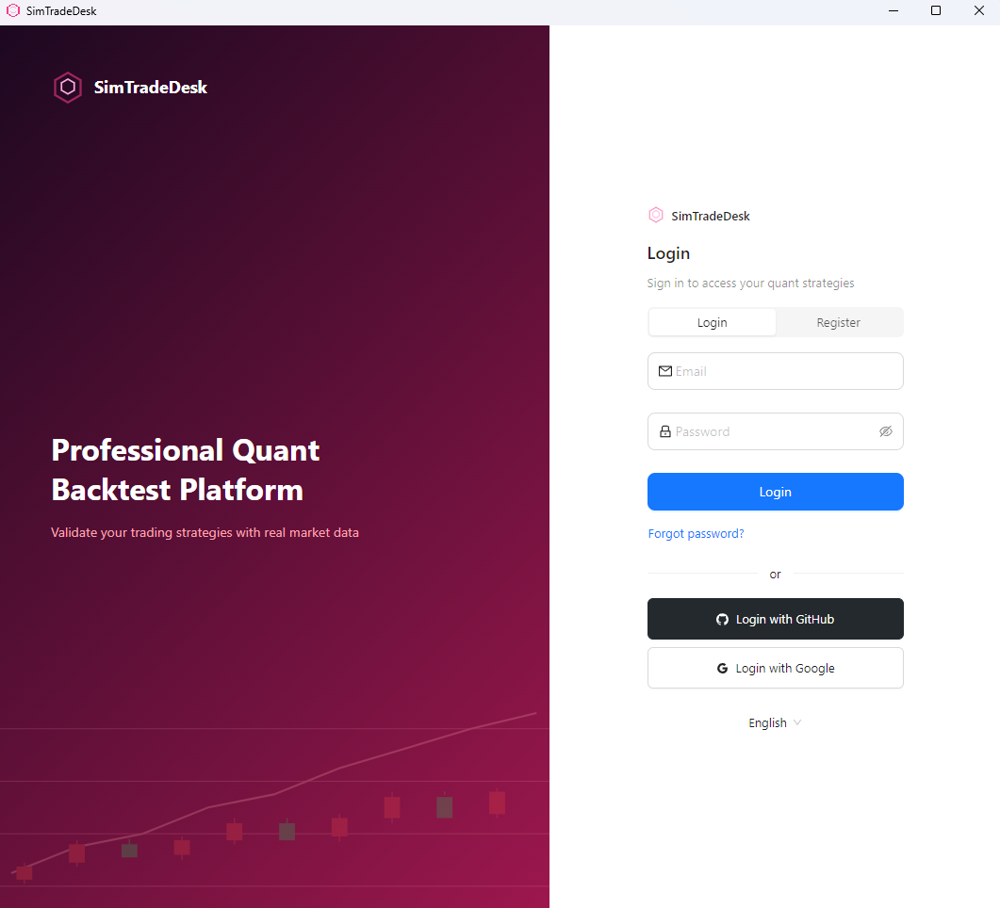
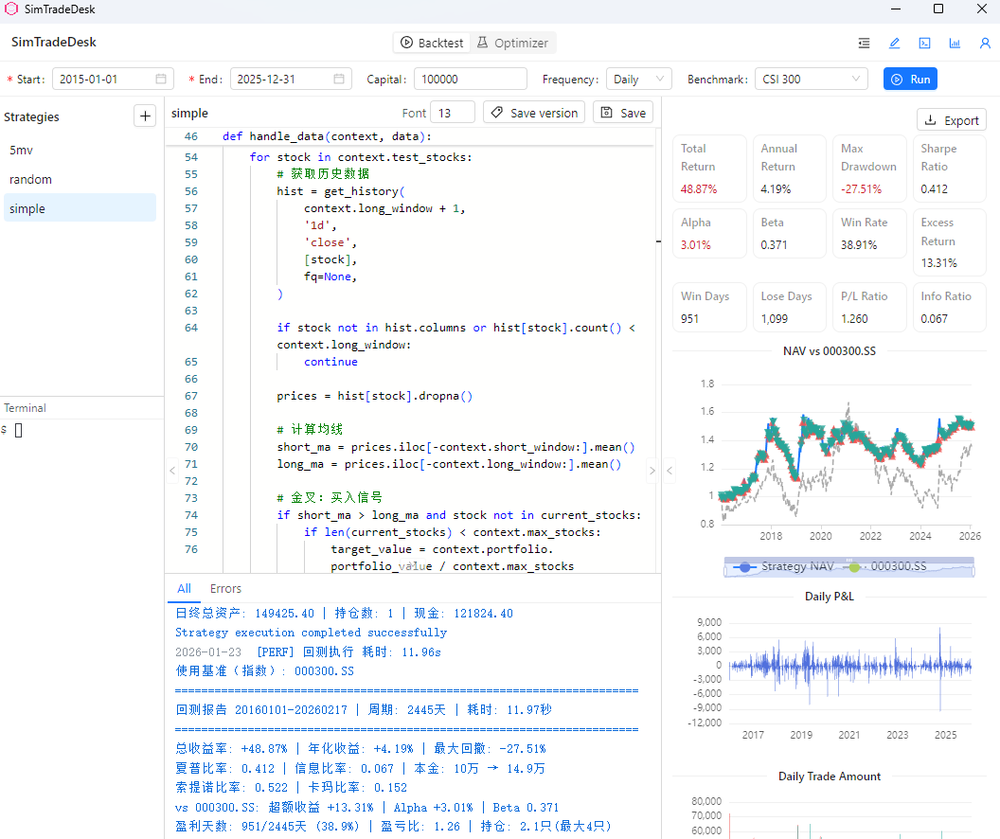
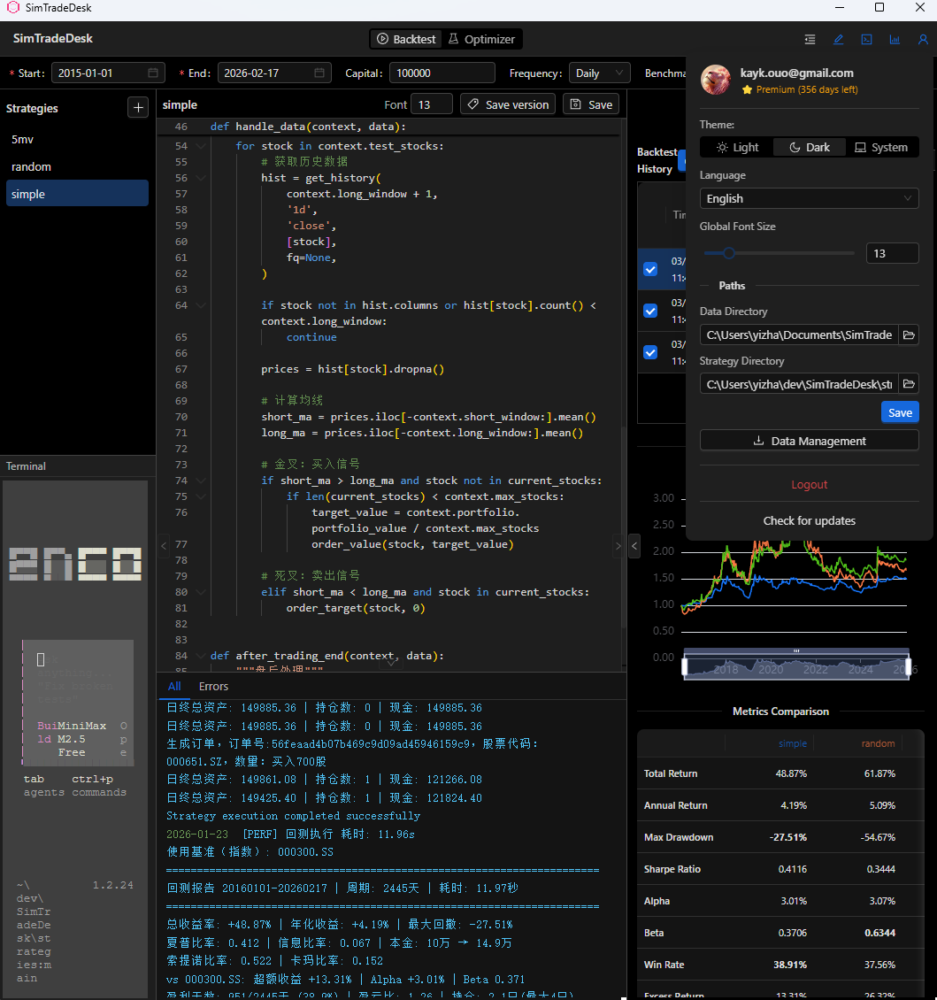
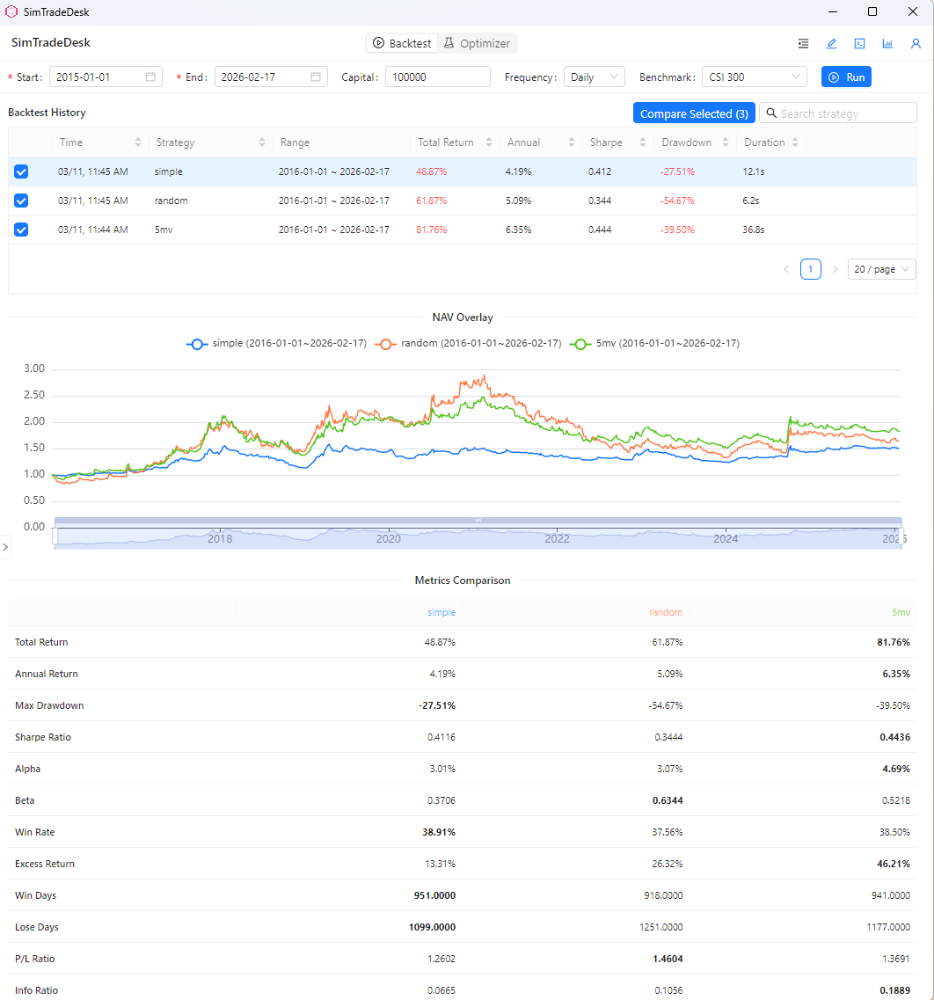
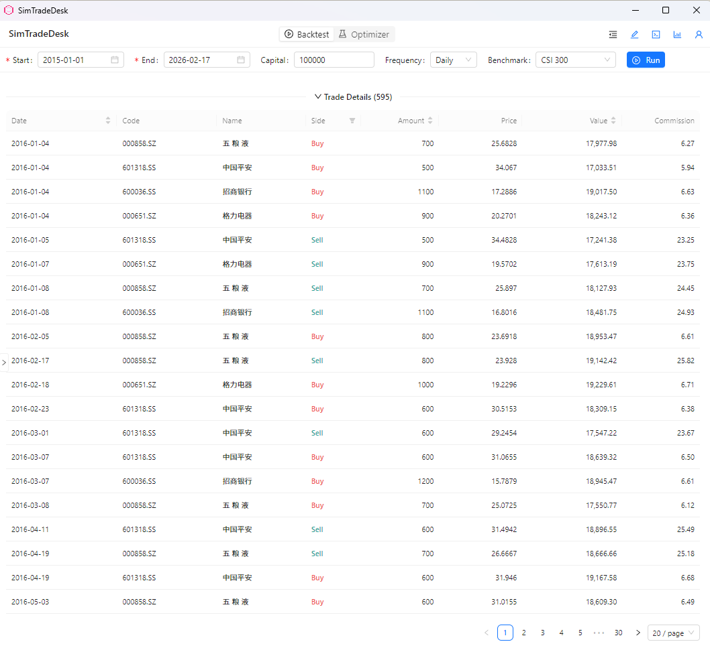
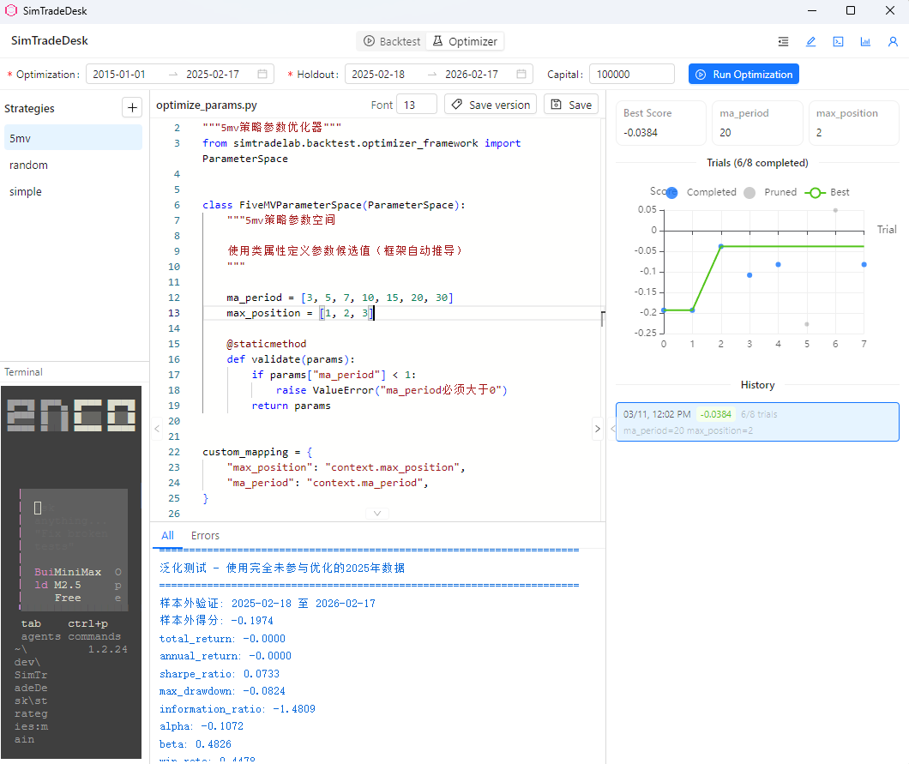
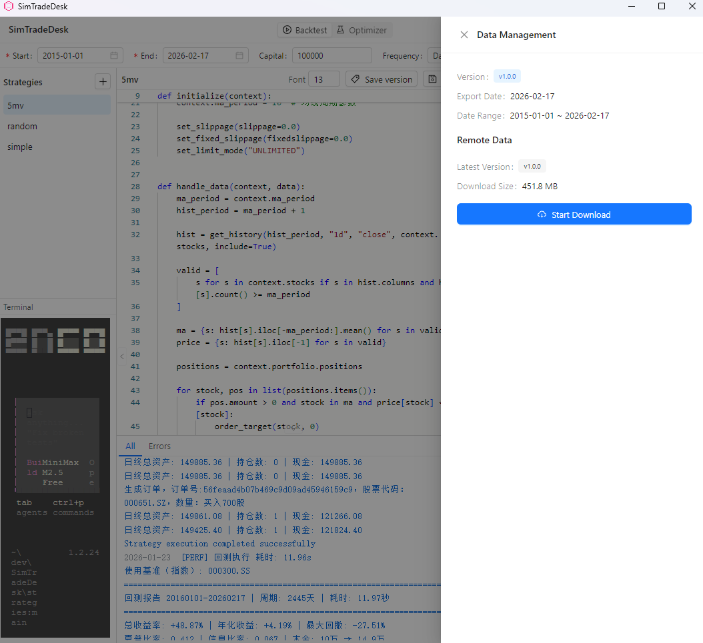
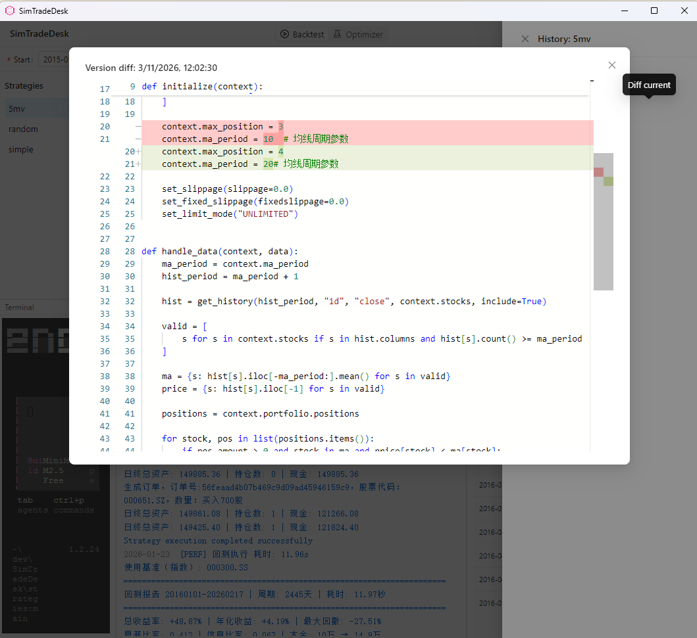
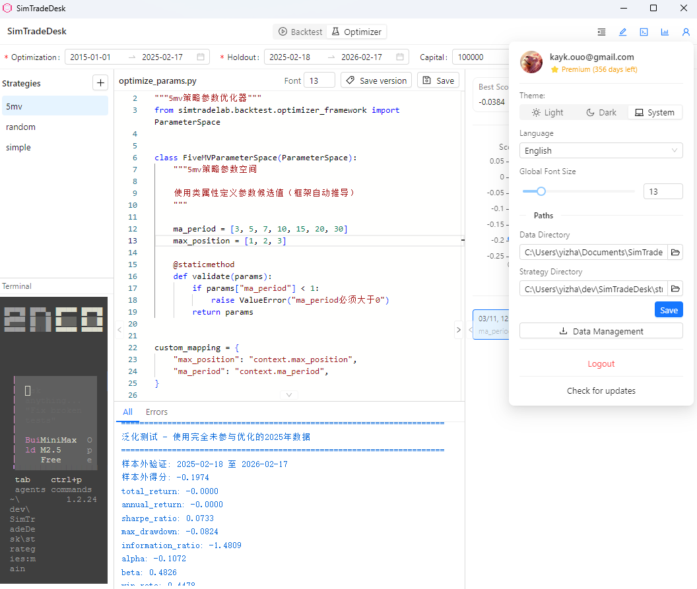
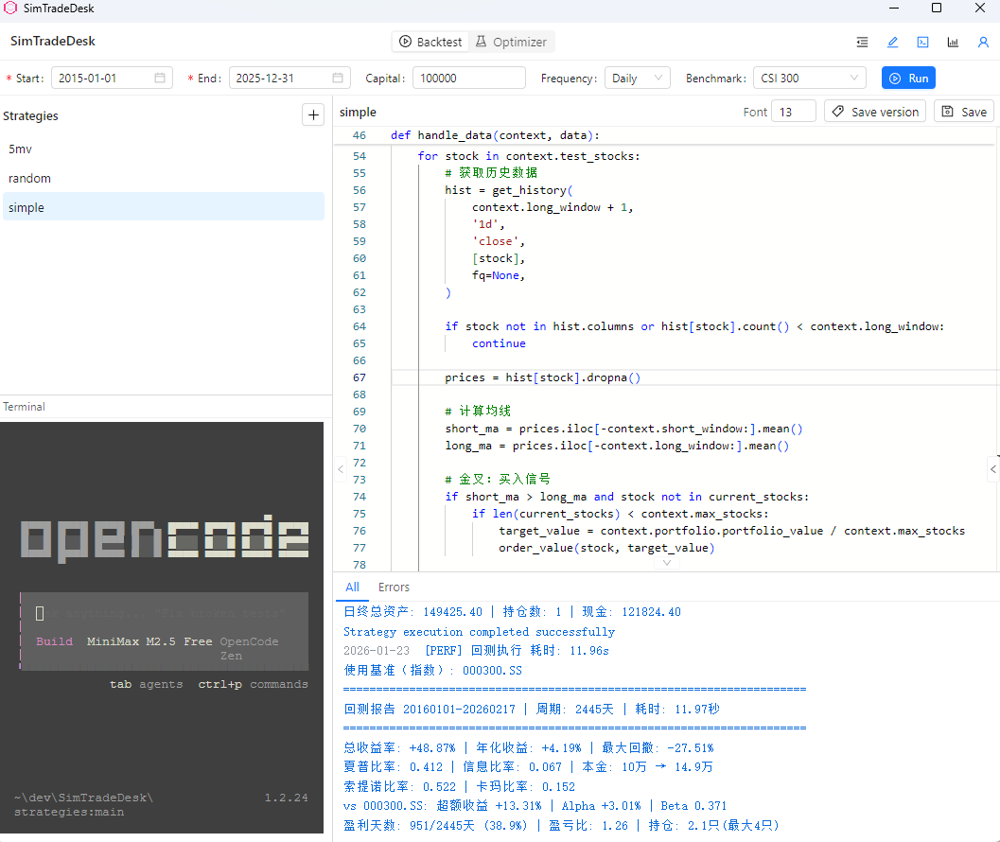

# SimTradeDesk

[English](./README.md) | [中文](./README_CN.md) | Deutsch

SimTradeDesk ist die dedizierte Desktop-Edition von SimTradeLab und bietet eine schnelle, sichere und vollständig lokale Umgebung für Strategieentwicklung, Backtesting, Simulation und Broker-seitige Bereitstellung. Es baut auf dem Open-Source-Kern SimTradeLab auf und bietet ein professionelles Desktop-Erlebnis in kommerzieller Qualität.

> **Kein Python. Keine Umgebungseinrichtung. Einfach herunterladen, installieren und Strategien entwickeln.**

## Funktionen

- **PTrade-kompatible API** — 46 Kern-APIs; Strategien laufen identisch auf PTrade und lokal
- **Strategie-Editor** — Autovervollständigung und Syntaxhervorhebung für PTrade-API
- **Backtesting** — A-Aktien-Historiendaten mit Echtzeit-Log-Streaming
- **Parameteroptimierung** — Hyperparametersuche mit Walk-Forward-Validierung (Optimierungs- + Haltezeitraum)
- **Ergebnisvisualisierung** — Eigenkapitalkurven, Drawdown-Charts, Handelshistorie und Schlüsselkennzahlen
- **Backtest-Vergleich** — NAV-Kurven überlagern mit Zeitachsenausrichtung und Kennzahlentabellen
- **Versionshistorie** — Automatische Strategie-Snapshots mit Diff-Ansicht und Ein-Klick-Wiederherstellung
- **CSV-/PNG-Export** — Datentabellen und Charts exportieren
- **Integriertes Terminal** — Kommandozeile für schnelles Debugging
- **Mehrsprachige Oberfläche** — Chinesisch / Englisch / Deutsch
- **Plattformübergreifend** — Windows, macOS, Linux

## Screenshots

| Screenshot | Beschreibung |
| --- | --- |
|  | Anmeldeoberfläche |
|  | Hauptoberfläche von SimTradeDesk |
|  | Dunkles Farbschema |
|  | Backtest-Vergleich mit überlagerten NAV-Kurven |
|  | Handelsdetail-Tabelle |
|  | Parameteroptimierung |
|  | Datenverwaltung |
|  | Versionshistorie mit Diff-Ansicht |
|  | Benutzereinstellungen |
|  | Integriertes Terminal |

## Download

Vorgefertigte Installationsdateien finden Sie auf der [Releases](https://github.com/kay-ou/SimTradeDesk/releases)-Seite.

| Plattform | Datei |
| --------- | ----- |
| Windows | `SimTradeDesk-Setup-x.y.z.exe` |
| macOS | `SimTradeDesk-x.y.z.dmg` |
| Linux | `SimTradeDesk-x.y.z-linux.AppImage` / `.deb` |

## Produktstufen

| Funktion | Basic | Premium |
| --- | :---: | :---: |
| Strategiebearbeitung & Backtesting | ✓ | ✓ |
| Backtest-Historie & Wiederherstellung | ✓ | ✓ |
| Versionshistorie & Diff | ✓ | ✓ |
| Mehrsprachig & Themes | ✓ | ✓ |
| Parameteroptimierung | | ✓ |
| Backtest-Vergleich | | ✓ |
| Handelsdetail-Tabelle | | ✓ |
| Datenexport (CSV / PNG) | | ✓ |
| Historiensuche | | ✓ |
| Integriertes Terminal | | ✓ |

Neue Benutzer erhalten eine **30-tägige Premium-Testversion** bei der Registrierung.

## Changelog

Siehe [CHANGELOG.md](./CHANGELOG.md).

## Feedback & Probleme

Fehler gefunden oder Feature-Wunsch? Bitte öffnen Sie ein [Issue](https://github.com/kay-ou/SimTradeDesk/issues).

## Lizenz

Proprietär. Alle Rechte vorbehalten — Kontakt: kayou@duck.com.
